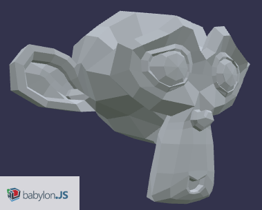

# YUP
Scene importer and exporter for Blender



# Test by blender python module

* https://en.blender.org/index.php/User:Ideasman42/BlenderAsPyModule

```py
import sys
import bpy


print('setup scene')
if len(sys.argv)>1:
    bpy.ops.wm.open_mainfile(filepath=sys.argv[1])
else:
    objs = [o for o in bpy.data.scenes[0].objects]
    for o in objs:
        bpy.data.objects.remove(o, True)

    def create_mesh(mesh):
        # Construct the bmesh cube and assign it to the blender mesh.
        import bmesh
        bm = bmesh.new()
        #bmesh.ops.create_cube(bm, size=1.0)
        bmesh.ops.create_monkey(bm)
        bm.to_mesh(mesh)
        bm.free()
    mesh = bpy.data.meshes.new('Basic_Cube')
    new_obj = bpy.data.objects.new("Basic_Cube", mesh)
    print(new_obj, new_obj.data)
    #bpy.data.scenes[0].objects.link(new_obj)
    bpy.context.scene.objects.link(new_obj)
    create_mesh(mesh)


print('call plugin')
import addon_io_scene_yup
addon_io_scene_yup.register()
bpy.ops.export_scene.yup('EXEC_DEFAULT', filepath='tmp.gltf', selectedonly=False)
```
